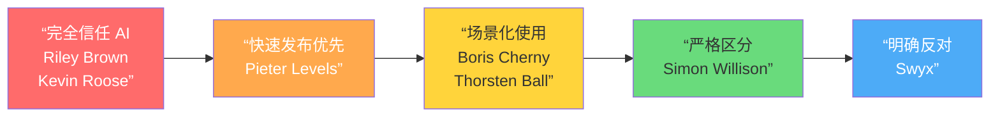

# 00 概述

## 什么是 vibecoding

“Vibe coding” 一词由 Andrej Karpathy 于 2025 年 2 月首次提出。

> [!quote] Andrej Karpathy, 2025-02-02
> There's a new kind of coding I call 'vibe coding', where you fully give in to the vibes, embrace exponentials, and forget that the code even exists.

在本仓库中，vibecoding 指的是一种 **以高层意图驱动、AI 深度参与** 的编程方式：
- **意图驱动**：用自然语言描述目标，让 AI 处理实现细节
- **节奏与反馈**：快速迭代、持续验证，保持”心流”状态
- **人机协作**：人负责方向和判断，AI 负责生成和执行

### 概念演进：从 Vibe Coding 到 Agentic Engineering

Karpathy 自己的观点也在演进。2026 年 2 月，他提出了 **”Agentic Engineering”** 作为更精确的术语：

> “Personally, my current favorite [term is] 'agentic engineering': 'agentic' because the new default is that you are not writing the code directly 99% of the time, you are orchestrating agents who do and acting as oversight — 'engineering' to emphasize that there is an art & science and expertise to it.”

这个演进反映了社区的共识：**随意的 vibe coding 适合原型，专业的 agentic engineering 适合生产**。

### 不同人眼中的 vibecoding

Karpathy 的原始定义偏向”完全信任 AI、不看代码”的极端实验，但实践中形成了一个**光谱**：

- **Karpathy**（概念提出者）：从最初的”完全信任 AI”，到后来承认 vibe coding 有局限（Nanochat 项目失败），最终提出 agentic engineering。（参见：[[karpathy-agentic-engineering]]）
- **Boris Cherny**（Claude Code 负责人）：vibecoding 是**场景化的**——主要适用于原型和一次性工作，正式代码仍需人工审查，质量标准与手写代码相同。（参见：[[vibecoding-is-situational]]）
- **Simon Willison**（Django 联合创始人）：强调 AI 编程中**理解代码的重要性**——AI 是”热情但经验不足的实习生”。（参见：[[simon-willison-ai-coding]]）
- **Pieter Levels**（独立开发者）：极端的”ship fast”派——代码质量不重要，产品验证最重要。（参见：[[pieter-levels-ship-fast]]）
- **Kevin Roose**（NYT 记者）：非程序员视角——用 vibe coding 构建**”一人软件”**，验证了门槛降低的价值。（参见：[[kevin-roose-software-for-one]]）
- **McKay Wrigley**（Cursor 教育者）：8 分钟克隆 Perplexity，用课程和实战演示教小白 Cursor 工作流。（参见：[[mckay-wrigley-cursor-workflow]]）
- **Sahil Lavingia**（Gumroad 创始人）：$10M ARR / 1 人运营，Slack 到生产 10 分钟，发起 Vibe Coder VC 基金。（参见：[[sahil-lavingia-ai-first]]）
- **Thorsten Ball**（Amp 开发者）：务实转型派——手写/AI 代码比例已翻转，”不是所有代码都值得手写”。（参见：[[thorsten-ball-agent-coding]]）
- **Fireship**：将 vibe coding 比作”用英语编程”，认为它降低了编程门槛但也带来了新的风险。

## 这不是

> [!warning] 常见误解
> - **不是无视工程质量的”快速堆砌”**——Boris Cherny 明确表示：”AI 代码和人类代码用同一个质量标准”
> - **不是无法复用的个人灵感记录**——好的 vibecoding 实践应该可以沉淀为流程和模板
> - **不是只靠提示词的魔法**——提示词只是工具链的一环，还需要任务拆解、审查、复盘

## 本仓库的目标

- 把个人经验转化为**可复用的方法**
- 把技巧归档为**流程与模板**
- 把案例拆解为**可学习的路径**
- 建立一个**可持续迭代的知识库**，而非一次性文档

## 延伸阅读

- Andrej Karpathy 的原始帖子：https://x.com/karpathy/status/1886192184808149383
- Boris Cherny 的 vibecoding 观点：`../notes/vibecoding-is-situational.md`
- Shrivu Shankar 的 Claude Code 全功能指南：`../notes/shrivu-shankar-claude-code-features.md`
- 零代码应用构建器对比：`../notes/no-code-app-builders.md`
- 工具安装指南：`10-tool-install-guide.md`
- Wikipedia 词条：https://en.wikipedia.org/wiki/Vibe_coding
