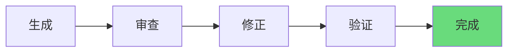
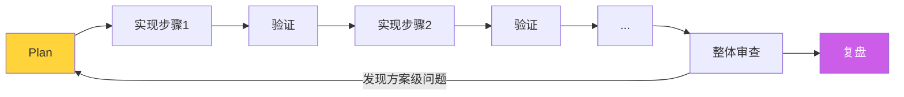

# 04 复盘、审查与迭代

## 人工审查：不可省略的环节

Boris Cherny 在多个场合强调：即使大部分代码由 AI 编写，**人工审查仍然是必要环节**。AI 生成的代码应与手写代码使用同一质量标准——不达标就不合并，迭代到达标。（参见：[[human-review-essential]]）

### 分层审查策略

不需要每一行都精读。根据代码的重要性分层：

| 层级 | 范围 | 审查深度 |
|------|------|----------|
| 关键路径 | 认证、支付、数据持久化 | 逐行精读，手写关键部分 |
| 业务逻辑 | API 端点、状态管理 | 通读逻辑，重点检查边界条件 |
| UI/样式 | 组件布局、样式调整 | 预览验证，快速扫描 |
| 脚手架代码 | 配置、样板文件 | 确认结构正确即可 |

### 用 Subagents 做批量审查

对于大范围审查（如安全审计、风格统一），Boris 推荐用 subagents：扇出多个 agent 并行审查不同模块，收集结果后人工去重和过滤误报。（参见：[[subagents-for-review]]）

## 复盘三问

每次完成一个任务后，问自己：

1. **目标是否达成？**——对照最初的成功标准
2. **偏差出现在哪一环？**——是目标不清、拆解不够、还是 AI 理解偏差？
3. **可复用的方法是什么？**——这次成功的模式能否模板化？

### 复盘的产出

复盘不是走形式，应该有具体产出：
- **更新 CLAUDE.md**：把犯过的错写成规则（参见：[[invest-in-claude-md]]）
- **创建 slash command**：把重复成功的工作流模板化（参见：[[slash-commands-standardize]]）
- **写原子笔记**：把可复用的技巧记录到 notes/

## 审查清单

### 最小版（每次必做）
- [ ] 逻辑是否闭环（输入 → 处理 → 输出 → 错误处理）
- [ ] 产物是否可验证（有测试或可运行的 demo）
- [ ] 是否引入安全风险（注入、未授权访问、敏感信息泄露）

### 完整版（重要功能）
- [ ] 代码符合项目规范（CLAUDE.md 中的规则）
- [ ] 边界条件已处理（空值、超时、并发）
- [ ] 性能可接受（无明显 N+1 查询或内存泄漏）
- [ ] 可维护性（命名清晰、职责单一、无过度抽象）
- [ ] 文档已更新（如果影响了公共 API）

## 迭代模式

### 单轮迭代

### 多轮迭代（复杂任务）

> [!important] Boris Cherny 的建议
> 当实现偏离计划时，**重新进入 plan mode**，而不是在错误的方向上继续修补。
