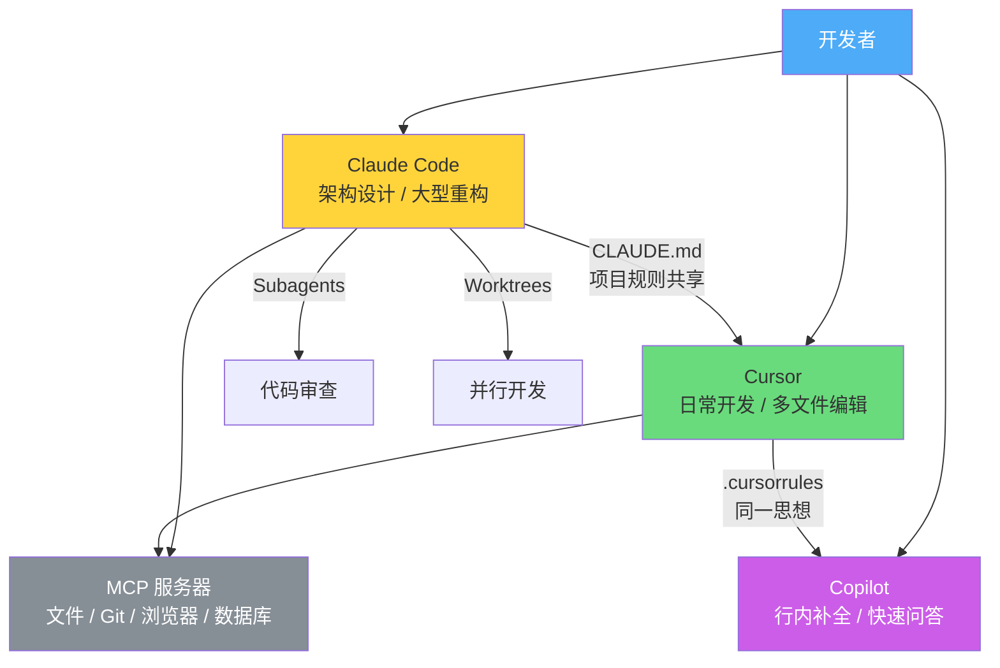

# 07 工具与实践

## 工具分类

### 交互式协作工具

| 工具 | 类型 | 核心特点 | 适用场景 |
|------|------|----------|----------|
| **Claude Code** | CLI Agent | 终端原生、plan mode、subagents、CLAUDE.md | 大型代码库、多文件修改、自动化工作流 |
| **Cursor** | AI IDE | Composer 多文件编辑、.cursorrules、Cmd+K | 日常开发、可视化编辑 |
| **GitHub Copilot** | IDE 插件 | 行内补全、Copilot Chat | 代码补全、快速问答 |
| **Windsurf** | AI IDE | Cascade 多步推理 | 多文件编辑、上下文感知 |
| **Replit Agent** | 在线 IDE | 自然语言到完整应用 | 快速原型、学习项目 |

### 质量保障工具

- **测试框架**：Vitest、Jest、Pytest——AI 生成代码后立即运行测试验证
- **Lint/Format**：ESLint、Prettier、Ruff——自动化代码规范检查
- **类型检查**：TypeScript strict mode、mypy——捕获 AI 引入的类型错误
- **CI/CD**：GitHub Actions——自动化验证流水线

### 知识管理工具

- **CLAUDE.md / .cursorrules**：项目级 AI 规则文件
- **Slash Commands / Skills**：可复用的工作流模板
- **MCP 服务器**：扩展 AI 工具的能力（文件系统、浏览器、数据库等）

## 重点工具详解

### Claude Code

Boris Cherny 将 Claude Code 定位为"原始的高级用户工具"，更像 Unix 工具而非精美 IDE。

**核心 Vibecoding 功能**：
- **Plan Mode**（Shift+Tab）：复杂任务前先对齐方案（参见：[[plan-mode-workflow]]）
- **Subagents**：并行处理子任务，保持主上下文干净（参见：[[subagents-for-review]]）
- **CLAUDE.md**：项目规则文件，AI 的持久记忆（参见：[[invest-in-claude-md]]）
- **Slash Commands**：标准化重复工作流（参见：[[slash-commands-standardize]]）
- **Hooks**：在特定事件时自动执行脚本（如 stop hook 自动重试）
- **Git Worktrees**：支持并行多会话开发（参见：[[parallel-sessions-worktrees]]）

**推荐工作流**：
1. 维护好 CLAUDE.md
2. 复杂任务用 plan mode 开始
3. 重复操作做成 slash commands
4. 大任务用 subagents 或并行会话

### Cursor

**核心 Vibecoding 功能**：
- **Composer**：多文件编辑，AI 理解整个项目上下文
- **.cursorrules**：类似 CLAUDE.md 的项目规则文件
- **Cmd+K**：选中代码后直接用自然语言修改
- **Chat**：在侧边栏与 AI 对话讨论方案

**推荐工作流**：
1. 维护好 .cursorrules
2. 用 Chat 讨论方案和架构
3. 用 Composer 做多文件修改
4. 用 Cmd+K 做局部调整

### GitHub Copilot

**核心 Vibecoding 功能**：
- **行内补全**：写代码时实时建议
- **Copilot Chat**：VS Code 侧边栏 AI 对话
- **Copilot Workspace**：从 issue 到 PR 的端到端工作流
- **.github/copilot-instructions.md**：项目规则文件

## 工具协作生态

不同工具之间并非互斥，而是互补。下图展示了一种典型的组合用法：

## 选型原则

1. **工具要服务流程**——先确定你的工作流，再选工具，而不是反过来
2. **工具要可替换**——不要把工作流绑定在某个特定工具上；CLAUDE.md 的思想可以迁移到 .cursorrules
3. **工具要易于复盘**——选择能保留操作历史的工具，方便事后回顾和学习
4. **组合使用**——Claude Code 做大型重构 + Cursor 做日常开发 + Copilot 做快速补全，并不冲突

> [!tip] 选型速查
> - **大规模重构 / 架构级**：Claude Code（1M context、subagents、worktree）
> - **日常开发**：Cursor（Composer 多文件、IDE 体验）
> - **已有 VS Code 工作流**：GitHub Copilot（无需切换工具）
> - **预算敏感 / 初学者**：Windsurf（$15/月、持久上下文）
> - **非技术用户 / MVP**：Replit Agent（零配置、端到端）

## 延伸阅读

- 工具详细配置和 MCP 参考：`../tools/skills.md`、`../tools/mcp.md`
