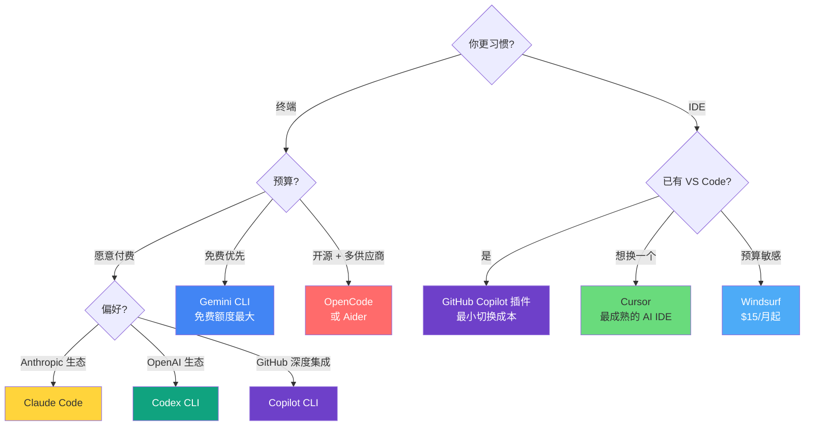

# 10 常见 Vibecoding 工具安装与使用指南

本章介绍主流 vibecoding 工具的安装、配置和基本用法。工具按**终端 Agent 类**和 **IDE 类**分两大阵营。

---

## 终端 Agent 类工具

终端 Agent 是 vibecoding 的核心战场——你在命令行里用自然语言描述意图，Agent 直接读写文件、运行命令、管理 Git。

### Claude Code

> Anthropic 出品的终端 Agent。Boris Cherny 将其定位为"原始的高级用户工具"，更像 Unix 工具而非精美 IDE。

**账号要求**：Pro（$20/月）、Max（$100/月或 $200/月）、Teams、Enterprise 或 API Console 账号。免费 Claude.ai 计划**不包含** Claude Code。

**安装（推荐：原生安装器，无需 Node.js）**：

```bash
# macOS / Linux
curl -fsSL https://claude.ai/install.sh | bash

# 验证
claude --version
```

Windows 用户需先安装 Git for Windows，然后在 PowerShell 中运行安装命令。

**备选安装（npm，已不推荐）**：

```bash
npm install -g @anthropic-ai/claude-code
```

**首次启动**：

```bash
cd your-project
claude
# 首次运行会引导浏览器登录授权（一次性）
```

**核心功能速查**：

| 功能 | 操作 | 说明 |
|------|------|------|
| Plan Mode | `Shift+Tab` | 复杂任务先对齐方案再实现 |
| Subagents | 自然语言指令 | 并行处理子任务 |
| CLAUDE.md | 项目根目录创建 | AI 的持久记忆和项目规则 |
| Slash Commands | `/commit`、`/review` 等 | 标准化重复工作流 |
| Hooks | 配置文件 | 特定事件时自动执行脚本 |
| Worktrees | Git worktree | 并行多会话开发 |

**推荐起步工作流**：
1. 在项目根目录创建 `CLAUDE.md`，写入项目约定
2. `cd your-project && claude`
3. 简单任务直接描述；复杂任务先按 `Shift+Tab` 进入 plan mode
4. 遇到问题用 `claude doctor` 自检

**参考**：
- 官方文档: https://code.claude.com/docs/en/setup
- Boris Cherny 的工作流: `../notes/boris-cherny-vibecoding.md`

---

### OpenAI Codex CLI

> OpenAI 出品的开源终端 Agent，用 Rust 构建，连接 o3/o4-mini/GPT-5-Codex 等模型。代码在本地执行，推理在云端。

**账号要求**：ChatGPT Plus、Pro、Business、Edu 或 Enterprise 计划，或 API Key。

**安装**：

```bash
# npm
npm install -g @openai/codex

# Homebrew（macOS）
brew install --cask codex

# 或直接从 GitHub Releases 下载二进制文件
```

**平台支持**：macOS、Linux 完整支持；Windows 实验性支持。

**首次启动**：

```bash
cd your-project
codex
# 提示登录 ChatGPT 账号或输入 API Key
```

**核心功能**：
- 本地代码读写 + 云端 AI 推理的混合架构
- 支持图片输入（截图、线框图、设计稿）
- 内置 to-do 追踪、Web 搜索、MCP 集成
- GPT-5-Codex 模型，专为 agentic coding 优化

**参考**：
- GitHub: https://github.com/openai/codex
- 官方文档: https://developers.openai.com/codex/cli/

---

### Gemini CLI

> Google 出品的开源终端 Agent（Apache 2.0），基于 Gemini 模型，**免费额度慷慨**。

**账号要求**：个人 Google 账号即可（免费）。付费计划可提升限额。

**免费额度**：60 请求/分钟，1000 请求/天。

**安装**：

```bash
# 快速试用（无需安装）
npx @google/gemini-cli

# 全局安装
npm install -g @google/gemini-cli
```

**核心功能**：
- 1M token 上下文窗口（Gemini 3 模型）
- 内置工具：Google Search、文件操作、Shell 命令、Web Fetch
- MCP 支持，可连接 GitHub、数据库等外部系统
- 完全开源（Apache 2.0）

**适用场景**：预算敏感的开发者、想在终端尝试 agentic coding 但不想付费的用户。

**参考**：
- GitHub: https://github.com/google-gemini/gemini-cli
- 官方文档: https://developers.google.com/gemini-code-assist/docs/gemini-cli

---

### GitHub Copilot CLI

> GitHub 出品的终端 Agent，2026 年 2 月 GA。深度集成 GitHub 生态，支持多模型切换。

**账号要求**：任何 GitHub Copilot 计划（Free、Pro、Pro+、Business、Enterprise）。

**安装**：

```bash
npm install -g @github/copilot
# 然后用 GitHub 凭据登录
```

**核心功能**：

| 模式 | 触发方式 | 说明 |
|------|----------|------|
| Plan Mode | `Shift+Tab` | 先规划再执行 |
| Autopilot | 设置中开启 | 全自动执行，无需逐步审批 |
| Background | 提示词前加 `&` | 委派给云端 Agent，释放本地终端 |
| Fleet | `/fleet` | 多个 subagent 并行执行同一任务 |

- 模型选择：Claude Opus 4.6、Sonnet 4.6、GPT-5.3-Codex、Gemini 3 Pro 等
- 内置 GitHub MCP 服务器 + 自定义 MCP 支持
- 专用 Agent：Explore（代码分析）、Task（构建测试）、Code Review、Plan

**参考**：
- GitHub: https://github.com/github/copilot-cli
- 变更日志: https://github.blog/changelog/2026-02-25-github-copilot-cli-is-now-generally-available/

---

### OpenCode

> 开源的 Go 语言终端 Agent，45K+ GitHub Stars。提供精美的 TUI 界面，支持多种 AI 供应商。

**安装**：

```bash
# 一键脚本
curl -fsSL https://opencode.ai/install | bash

# npm
npm install -g opencode-ai@latest

# Homebrew（macOS/Linux）
brew install anomalyco/tap/opencode

# Windows
scoop install opencode
# 或
choco install opencode
```

**核心功能**：
- 精美的 TUI 界面（基于 Bubble Tea）
- 双内置 Agent：**build**（默认，全权限开发）和 **plan**（只读分析）
- 支持 OpenAI、Anthropic、Google Gemini、AWS Bedrock、Groq 等多供应商
- Vim 风格编辑器、SQLite 持久存储、LSP 集成
- 非交互模式：`opencode -p "Explain the use of context in Go"`

**配置供应商**：

```bash
opencode auth login
# 交互式配置 API Key，存储在 ~/.local/share/opencode/auth.json
```

**参考**：
- 官网: https://opencode.ai
- GitHub: https://github.com/opencode-ai/opencode
- 文档: https://opencode.ai/docs/

---

### Aider

> 开源终端 AI 结对编程工具，自动 Git 提交，支持数十种 LLM 供应商和本地模型。

**安装**：

```bash
# 推荐方式（自动安装 Python 3.12）
python -m pip install aider-install
aider-install

# 或用 uv
python -m pip install uv
uv tool install --force --python python3.12 --with pip aider-chat@latest

# Docker
docker pull paulgauthier/aider
```

**使用**：

```bash
cd your-project

# 使用 Claude
aider --model sonnet --api-key anthropic=YOUR_KEY

# 使用 DeepSeek
aider --model deepseek --api-key deepseek=YOUR_KEY

# 使用 GPT-4o
aider --model o3-mini --api-key openai=YOUR_KEY
```

**核心特点**：
- 每次修改自动创建**原子 Git 提交**（干净的版本历史）
- 支持多文件协调修改
- 成本极低：GPT-4o 约 $0.01-0.10/feature，DeepSeek 更便宜
- 支持本地模型（通过 Ollama）

**参考**：
- 官网: https://aider.chat/
- GitHub: https://github.com/Aider-AI/aider

---

## IDE 类工具

IDE 类工具提供可视化界面，适合偏好图形化操作的开发者。

### Cursor

> 基于 VS Code 的 AI-first 代码编辑器，vibe coding 社区最热门的 IDE 工具。

**安装**：
1. 访问 https://cursor.com 下载对应平台安装包
2. 启动后可选择导入 VS Code 设置
3. 注册账号（免费版有有限的 AI 补全额度，新用户可试用 Pro 功能）

**核心功能**：

| 功能 | 快捷键 | 说明 |
|------|--------|------|
| Chat | `Cmd+L` | 侧边栏 AI 对话 |
| Inline Edit | `Cmd+K` | 选中代码后自然语言修改 |
| Composer | 菜单 | 多文件编辑，理解整个项目 |
| Agent Mode | 设置中开启 | 全自动执行（创建文件夹、写代码、调试） |
| Tab 补全 | `Tab` | AI 预测下一步操作 |

**项目规则**：在项目根目录创建 `.cursorrules` 文件（类似 CLAUDE.md）。

**参考**：
- 官网: https://cursor.com
- Vibe Coding 完整指南: https://www.youware.com/blog/cursor-vibe-coding-complete-guide

---

### Windsurf

> 前身为 Codeium，重新定位为 AI-first IDE。核心特点是 Cascade 多步推理引擎。

**安装**：

```bash
# Homebrew（macOS）
brew install --cask windsurf

# 或从官网下载安装包
# Windows: .exe 安装器
# Linux: .deb / .AppImage
```

也可作为 VS Code / JetBrains 插件使用。

**核心功能**：
- **Cascade**：三种模式——Write（直接改代码）、Chat（只聊不改）、Turbo（全自动）
- **Supercomplete**：预测意图而非仅预测下一个词
- **Memory**：持久化学习你的编码风格
- **Image-to-Code**：拖入设计稿直接生成代码
- **Previews**：IDE 内实时预览网页，点击元素让 AI 修改

**定价**：Free（25 credits/月）、Pro（$15/月）、Teams（$30/用户/月）、Enterprise（$60/用户/月）。

**参考**：
- 官网: https://windsurf.com
- 下载: https://windsurf.com/download

---

## 工具对比速查表

| 工具 | 类型 | 开源 | 免费层 | 最低付费 | 核心优势 |
|------|------|------|--------|----------|----------|
| **Claude Code** | 终端 Agent | 否 | 无 | $20/月 | Plan mode、subagents、1M context |
| **Codex CLI** | 终端 Agent | 是 (Rust) | 无 | ChatGPT Plus | 图片输入、GPT-5-Codex |
| **Gemini CLI** | 终端 Agent | 是 (Apache 2.0) | 1000 次/天 | 免费 | 最慷慨免费额度、1M context |
| **Copilot CLI** | 终端 Agent | 否 | 有限 | Copilot Free | GitHub 深度集成、多模型 |
| **OpenCode** | 终端 Agent | 是 (Go) | 取决于供应商 | 取决于供应商 | 精美 TUI、多供应商 |
| **Aider** | 终端 Agent | 是 (Python) | 取决于供应商 | 取决于供应商 | 自动 Git 提交、本地模型 |
| **Cursor** | AI IDE | 否 | 有限额度 | $20/月 | Composer 多文件、最成熟的 AI IDE |
| **Windsurf** | AI IDE | 否 | 25 credits/月 | $15/月 | Cascade 多步推理、价格亲民 |

## 选型建议



## 延伸阅读

- 工具协作生态和选型原则: `07-tools.md`
- MCP 服务器配置: `../tools/mcp.md`
- Slash Commands / Skills 详解: `../tools/skills.md`
